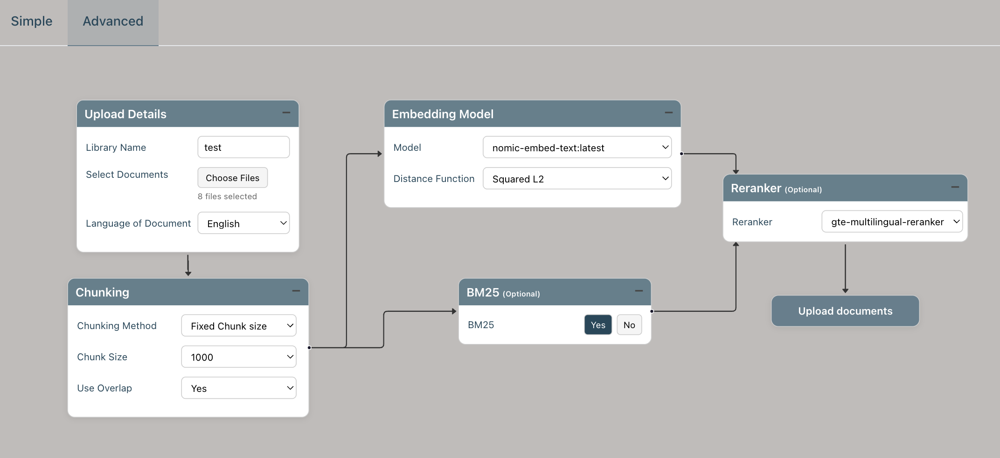

# FAQs

- [Asking questions](#asking-questions)
- [MyGPT answers](#mygpt-answers)
- [Confidence metrics](#confidence-metrics)
- [Library Creation](#library-creation)
- [Installation](#installation)
- [Customization](#customization)
- [General developers](#general-developers)

## Asking questions

### 1.	What kind of questions can I ask MyGPT?
During MyGPT evaluation, we have used six different question types as follows:
•	Keyword search: An acronym or a definition from the papers. For example, “What is acetyl-CoA?”
•	Summarization: Question that summarize a topic or method. For example, “What is the proof that pathogenic gain-of-function mutations can shift the equilibrium towards the active state in FGFRs?”
•	Yes/no: The answer can be a simple yes or no. For example, “Does the regulatory domain inhibit the PAK4 kinase activity?”
•	Data query: Question to find data or other facts from a section or information from several papers. For example, “Where are the leukemia-related breakpoints located in CBP/p300?”
•	Complex question: A research question to collect information from different parts of a paper and synthesize a response. For example, “What are the biggest issues facing the development of better CAR-T therapies? Rank them in order of difficulty and provide examples with citations on all potential strategies to overcome these limitations.”
•	Irrelevant question: A question about a topic that is not covered by the publication library. For example, asking questions about Harry Potter to a library of GPCR documents: “What does Hagrid give Harry as a Christmas present?”.   
You can also ask questions that do not follow the above categories, and MyGPT will answer them if they are within the limits of LLMs and RAG concepts. Several tasks, such as performing statistical analysis, analyzing whole documents, or listing references from literature with high accuracy, are beyond the current capability of LLMs and MyGPT.

### 2. Can I ask any questions about topics from my library?
You can ask questions that can be answered using the information available within your document library. If the data is missing from the documents, MyGPT will not be able to answer it or will let you know that the information is missing from your papers.
 
### 3. Can I ask a question about information that is in tables or figures in the library documents?
MyGPT will read tables as text and try to use that information to answer your question. However, it will not be able to parse the table and find the relationship between table columns and information from the table. Also, MyGPT will not perform statistical analysis for data present in the table. MyGPT can’t find information from the figures if it can only be answered by interpreting it or by performing the statistical analysis, although it will be able to read the legend of the figure. If the question can be answered using the legend, it can answer it.

## MyGPT answers

### 4.	What information does MyGPT uses to answer my question?
MyGPT uses information in the documents in your library as the primary source of information. If the information is missing from the library, MyGPT will use inherent knowledge of LLM, which was used for the training phase of specific LLM.

### 5. Is MyGPT using the internet to answer my question?
MyGPT does not use the internet or any external API services to get information to answer your question.

### 6. Can I use MyGPT to chat with LLM without incorporating the documents pipeline (RAG), like ChatGPT?
You can use MyGPT to chat directly with LLM without the RAG pipeline. At the top of the Chat panel, you can use the drop-down to switch from "Chat with Documents" to "Direct chat with GPTs". In this case, MyGPT will use LLM’s inherent knowledge to answer users' questions.


### 7. What happens if the information to answer the question is not available in my library?
If the information needed to answer the question is unavailable in your library, MyGPT will either acknowledge that it is missing from the library or, in rare cases, use the LLM’s inherent knowledge to answer it. It will also provide confidence matrices in the form of question relevance score (QRS), answer relevance score (ARS), and hallucination index (HI). Low QRS, QRS, and high HI should be interpreted as an indication to verify and cross-reference the generated answer with the retrieved context highlighted in the documents. Suppose the question is off-topic from the subjects covered in the papers. In that case, the QRS and ARS scores will be low, and HI will be high, indicating that the generated answer does not use any information from the document and is entirely generated using the LLM's inherent knowledge.  
   
### 8. If I am certain my library has the necessary information to answer the question, but MyGPT is not able to find it, what should I do?
We recommend several solutions if you are sure that the documents contain the information to answer the question. 
1.	The first thing to try is rephrasing it and providing more context with your question if it’s too short. 
2.	You can also adjust QRS and ARS cut-off values from the customizations. Certain words in embedding models have a higher distance than our perceived understanding of language as the specific domain knowledge was lacking in training of embedding models. Increasing the QCworst and Aworst values can aid in finding the correct context from documents.  
3.	We have also observed different embedding models provide different meanings to the same library of documents. So, if rephrasing and adjusting relevance scores doesn’t work, we recommend creating the same library with a different embedding model.
 
### 9. What happens if the information to answer the question is contained in a figure or table?
MyGPT will read tables as text and try to use that information to answer your question. However, it will not be able to parse the table and find the relationship between table column names and the data from the table. Also, MyGPT will not perform statistical analysis for data present in the table. MyGPT will be able to read the legend of the figure. If the question can be answered using the legend, it can answer it. However, if your question can only be answered by interpreting the figure or by comparing data present in your figure, MyGPT will not be able to answer it.

### 10. If there is information on my library that is outdated or inconsistent with facts available in public domain, will MyGPT detect the inconsistency?
MyGPT is designed to perform question-answering in the context of your library of documents and will hold the information from your documents as the highest truth. If the information in your document is outdated compared to facts in the public domain, MyGPT will answer them using only information from your documents. If the LLM has more up-to-date information about your question, the answer relevance score (ARS) and hallucination index (HI) may be able to guide you. MyGPT also provides answers generated without the RAG pipeline as the drop-down with the original MyGPT-generated answers. You can compare that answer with an original answer to verify the discrepancy in relevance scores. However, if the most up-to-date information about your topic is also missing from LLM training data, MyGPT will answer it only using information from your documents.  


### 11. If the answer is related to up-to-date information that is contained in my library but that was missing from the training data used for the LLM being used, will MyGPT be able to answer accurately?
Yes, MyGPT uses the facts present in your documents as the highest truth and will be able to use them as context to answer your question. MyGPT does not rely on LLM training data and eliminates the need for periodic retraining of LLMs with new information.

### 12.	Is MyGPT using any personal information about me as the knowledge base?
No, MyGPT does not use any personal information. It uses login information for hosted instances and it's independent of the RAG pipeline.

### 13.	Is there chat history available anywhere?
Yes, MyGPT has a “History” menu to access chat history, which is available for any public library or your libraries after logging in.

## Confidence metrics

### 14.	What are confidence metrics?
**Confidence metrics** are quantitative scores that MyGPT uses to gauge the trustworthiness of a generated answer.

* **QRS (Question Relevance Score)** – measures how well the user’s question matches the content in the document library. A high QRS indicates the question is on‑topic and likely supported by retrieved text.

* **ARS (Answer Relevance Score)** – evaluates how closely the answer aligns with the retrieved passages. A higher ARS indicates that the response is grounded in the source material.

* **HI (Hallucination Index)** – identifies potential hallucinations. A high HI signals that the answer may be largely generated from the LLM’s internal knowledge rather than the library, especially when QRS and ARS are low.

Together, these metrics help users determine whether an answer is supported by actual documents or might be a hallucinated response, enabling better verification and trust in the system.

### 15.	How are question relevance scores (QRS) and answer relevance scores (ARS) calculated, and how to interpret them?
**How QRS and ARS are computed**

| Score | Formula |
|-------|----------------------|
| **Question relevance scores (QRS)** | $$QRS=\left(a\times\frac{\sum_{i=1}^{k}Q_{sem,i}}{k}\right)+\left(b\times\frac{\sum_{i=1}^{k}Q_{key,i}}{k}\right)+\left(c\times\frac{\sum_{i=1}^{k}Q_{rerank,i}}{k}\right)$$ |
| **Answer relevance scores (ARS)** | $$ARS=\left(x\times\frac{\sum_{i=1}^{k}A_{sem,i}}{k}\right)+\left(y\times\frac{\sum_{i=1}^{k}A_{key,i}}{k}\right)+\left(z\times\frac{\sum_{i=1}^{k}A_{rerank,i}}{k}\right)$$ |

- $Q_{\text{sem}}, A_{\text{sem}}$: semantic similarity scores (vector-search).
- $Q_{\text{key}}, A_{\text{key}}$: keyword/BM25 scores.
- $Q_{\text{rerank}}, A_{\text{rerank}}$: cross-encoder rerank scores (0-1).

The sums are taken over the top‑k retrieved chunks that form the “golden context”.

**Interpretation**

| Score | Typical range | What it indicates |
|-------|---------------|-------------------|
| **High QRS** (close to 1) | Question is well‑matched to the library. | The library likely contains the needed information. |
| **Low QRS** (< 0.3) | Question poorly matches the library. | Information may be missing or irrelevant. |
| **High ARS** (close to 1) | Answer heavily relies on retrieved context. | Generated answer is grounded in the documents. |
| **Low ARS** (< 0.3) | Answer uses little or no retrieved content. | Possible hallucination; verify against source. |

The Hallucination Index (HI) combines QRS and ARS: low QRS/ARS → high HI, flagging potential hallucinations. Use these metrics to decide whether a generated answer should be trusted or cross‑checked with the documents.

### 16.	How is the hallucination index (HI) calculated, and how to interpret it?
Hallucination Index (HI) is a single‑score metric that blends the Question Relevance Score (QRS) and the Answer Relevance Score (ARS) to flag how much an LLM’s response may be “hallucinated” (i.e., not supported by the retrieved library).

$$HI = 1 - \left(\frac{p \times QRS}{p + q}\right) - \left(\frac{q \times ARS}{p + q}\right)$$

p and q are weighting factors that can be determined by global sensitivity analysis.

- **HI ≈ 0** – high QRS and ARS → the answer is strongly grounded in the library; hallucination unlikely.
- **HI close to 1** – low QRS or ARS → the answer likely relies on the LLM’s internal knowledge rather than the document set; higher risk of hallucination.

Thus, a lower HI signals a trustworthy, evidence‑based reply, while a higher HI warns that the response may contain unsupported or fabricated content.

### 17.	Can I change the calculations of QRS, ARS, and HI?

Yes, the default formulas are provided in the paper and the software, but they are not hard‑coded as the only possible choice. The weights (a,b,c) to calculate QRS and (x,y,z) to calculate ARS were chosen by a global‑sensitivity analysis that maximized PR‑AUC. If you prefer different weighting, you can re‑run the same heat‑map optimization with your own dataset or simply plug in new values from the chat settings menu.


### 18.	I am asking a question, and it’s about a topic in the library, but it gives me 0% relevance. Is it possible to relax the cutoff values for QRS?

Yes, MyGPT allows you to lower the QRS threshold so that documents with weaker matches can be retrieved.

Here’s how:
1. **Re‑phrase the question**: A longer or more specific query often yields higher semantic scores.

2. **Adjust the cutoff parameters**: In the MyGPT settings, you can change the weights (a, b, c). Setting c=0 removes reranking and provides all chunks from semantic and keyword searches. Or you can increase QCworst (the minimum cosine similarity allowed) and Aworst (the lowest keyword score accepted). Raising these values will relax the filter and bring more chunks into consideration.

3. **Try a different embedding model**: Some models encode domain terms better; switching to an alternative can improve relevance scores for your topic.

If, after these steps, the QRS remains 0 % and no relevant passages appear, it’s likely that the library simply does not contain the needed information. In that case, you may need to add additional documents or verify that the content is present in the existing files.

## Library creation

### 19.	What are the options for creating a library?

**Options for creating a MyGPT library**

1. **Direct upload through MyGPT**
- *Simple upload*: Add PDFs, Word files, etc., with default preprocessing.
- *Advanced settings*: Customize the chunk size/method, overlap, embedding model, distance function, BM25, reranker, and other retrieval parameters before building the library.

2. **Import from a Zotero collection**
- Create or use an existing private/shared Zotero library of publications.
- Use MyGPT’s “Add Zotero collection” API to pull that collection into a new dataset/library within MyGPT.

Both methods produce a pre‑processed, searchable library that can be accessed from the MyGPT home page and used for RAG queries.

### 20.	What document types are supported by MyGPT?

MyGPT supports PDFs, DOC files ('.doc', '.docx'), and TEXT (.txt) files. 
MyGPT can only extract text from the PDF and DOC files; it can't answer questions from images in the files.

### 21.	What is the library size limit supported by MyGPT?

We have tested MyGPT on 800 PDFs totaling 10,000 pages. MyGPT has an upper limit of 10 GB for uploads and 10,000 files. The large library size will require more time for uploading, but the retrieval and answer-generation steps will be unaffected by library size.

### 22.	How much time does it take to upload a library?

The upload time varies with the number of pages in the library and the processing hardware.

| Device | Pages | PDFs | Chunks | Upload | Retrieval (1st) | Retrieval (Avg) | Generation (1st) | Generation (Avg) | E2E (Avg) |
|----------|------:|----------:|--------------------------------:|------------|---------------------:|---------------------:|----------------------:|----------------------:|----------------------:|
| Mac Laptop (M1 chip) | 10 | 1 | 70 | 2m10s | 1.28s | 1.06s | 6.39s | 2.99s | 11s |
| Mac Laptop (M1 chip) | 100 | 2 | 235 | 2m33s | 1.18s | 0.62s | 4.16s | 6.03s | 17s |
| Mac Laptop (M1 chip) | 1000 | 4 | 3211 | 5m53s | 0.73s | 0.59s | 3.16s | 3.9s | 12s |
| Mac Laptop (M1 chip) | 10000 | 791 | 58869 | 95m19s | 1.94s | 0.64s | 5.52s | 5.82s | 17s |
| Mac Laptop (M4 chip) | 10 | 1 | 70 | 2.05s | 0.38s | 0.225s | 0.84s | 1.205s | 4.5s |
| Mac Laptop (M4 chip) | 100 | 2 | 235 | 4.9s | 0.10s | 0.0775s | 2.04s | 2.295s | 4.5s |
| Mac Laptop (M4 chip) | 1000 | 4 | 3211 | 1m18s | 0.14s | 0.11333s | 1.9s | 2.049s | 4.2s |
| Mac Laptop (M4 chip) | 10000 | 791 | 58869 | 23m51s | 0.69s | 0.651s | 1.86s | 2.124s | 5.0s |
| SJ VM | 10 | 1 | 70 | 11s | 5.63s | 0.80s | 11.22s | 0.51s | 11s |
| SJ VM | 100 | 2 | 235 | 13s | 0.77s | 0.79s | 1.2s | 1.07s | 6.75s |
| SJ VM | 1000 | 4 | 3211 | 2m12s | 0.68s | 0.73s | 1.16s | 1.49s | 12.6s |
| SJ VM | 10000 | 791 | 58869 | 46m2s | 0.77s | 0.85s | 1.19s | 1.39s | 8s |

Thus, a small library of about 10 pages can be uploaded in roughly two minutes on an M1 Mac, while a larger 1000‑page library may take over one and a half hours on the same machine. Upload times drop dramatically when using higher‑performance GPUs such as the M4 or A100. The exact duration depends on your hardware and library size.

### 23.	How should I format my document library?

MyGPT accepts all kinds of documents, such as Biomedical literature, SOPs, or policies. We recommend not using scanned copies of documents, as MyGPT doesn't have OCR capability to extract text from photocopies.

### 24.	Can MyGPT help me with library creation, management, or library expansion related to topics covered by the library?

No, MyGPT doesn't allow creation or expansion of a library. It's the user's responsibility to collect all the documents they want to upload to MyGPT. Users can use third-party tools such as Zotero or EndNote to collect documents and PDFs, then either use MyGPT's Zotero plugin to add a Zotero library or export an EndNote library and upload the documents to MyGPT.

### 25.	If a library is shared with other users, can they see my chat history?

Yes, chat history is tied to the library, not to individual users.

When a library is marked public (or “shared” with other users), anyone with access to that library who logs in to MyGPT can view its chat history through the History menu. If the library remains private to you, only your own account will see the history. In short: shared/public libraries expose their chat history to all users who have permission; private libraries keep it visible only to you.

### 26.	If I delete the library, will it delete chat history as well?

Yes. When you delete a library, MyGPT removes all of its documents, vector embeddings, tokenizer, and associated chat history from the backend database.


## Installation

### 27.	What are the options for installing and using MyGPT?

MyGPT can be installed in the following environments:

- [Personal Computer](#personal-computer)
- [Server/VM with GPU](#server-or-vm-with-gpu)
- [Cloud services (Azure)](#cloud-services-azure)

#### Personal Computer

MyGPT uses Ollama as the LLM server and requires at least 8 GB RAM (16 GB recommended for better response time) and 10 GB of disk space.
Ollama provides direct installation support for macOS and Linux. For Windows, use Docker to run Ollama.

To run the pipeline on each platform, follow these instructions:

- Mac
  - [Basic Installation](./installation/macOS/README.md)

- Linux
  - [Basic Installation](./installation/linux/README.md)

- Windows
  - [Basic Installation](./installation/windows/README.md)

These instructions are simple to follow, and you can modify the bash scripts as needed.

#### Server or VM with GPU

MyGPT can be hosted on a server or VM with a GPU. For this setup, we recommend hosting the User Interface (UI), Backend server, and Ollama (LLM server) on three separate VMs. The Ollama VM should have a GPU with CUDA installed.

To run the pipeline on a VM/server, follow:

- [Linux Server Installation](./installation/vm/README.md)

#### Cloud services (Azure)

MyGPT can be hosted on any cloud provider, and Azure is provided as an example deployment. For this setup, we recommend hosting the User Interface (UI), Backend server, and Ollama (LLM server) on three separate VMs. The Ollama VM should have a GPU with CUDA installed.

To run the pipeline on Azure, follow:

- [Azure Installation](./installation/azure/README.md)

### 28.	What is the minimum requirement for installing MyGPT on a laptop?

The minimum specs for installing MyGPT on a laptop are:

- **CPU:** ≥ 8 cores
- **RAM:** ≥ 16 GB (the pipeline can run with 8 GB, but 16 GB is recommended for better response time)
- **GPU:** Required (any GPU that supports the chosen LLM via Ollama)
- **Storage:** ≈ 10 GB of free space

These are the baseline requirements listed in the installation documentation.

### 29.	How can I check if my computer/laptop is powerful enough to use MyGPT?

The limitation of running MyGPT on personal devices is the GPU and RAM.
To check if your lapotp has enough resources to run Ollama, you can run following command:

```
curl -o /dev/null -s -w 'Total: %{time_total}s\n' http://localhost:11434/api/generate -d '{"model": "llama3", "stream": false, "prompt": "Despite the diversity among GPCRs, are there similarities in their activation pathways?", "system":"Use the following information to answer the question in less than 200 words, try not to use anything else: [tipsychotics). GPCR activation is facilitated by extracellular ligands, and leads to the recruitment of intracellular G proteins 3,6. Structural rearrangements of residue contacts in the transmembrane domain serve as ‘activation pathways’ that connect the ligand- binding pocket to the G protein-coupling region within the receptor. How similar are these activation pathways across different class A GPCRs? Here, we analysed 27 GPCRs from diverse subgroups for which structures of active and/or inactive states are available. We show that despite the diversity in activation pathways between receptors, the pathways converge near the G protein- coupling region. This convergence is mediated by a strikingly conserved structural rearrangement of, eptor activation are broadly similar (e.g. contraction of ligand binding site, opening of the cytosolic side due to relocation of TM6). However, receptor activation is mediated by diverse ligands and hence some aspects of ligand-induced GPCR activation must necessarily be receptor-specific. How similar are the activation pathways across different receptors? We carried out a comprehensive comparison of residue contacts of inactive and active state structures. Structural equivalence for residues across the different GPCRs was assigned using the GPCRdb numbering scheme 19 from GPCRdb 20 (www.gpcrdb.org ) (Methods). A contact between a pair of residues is defined to exist if the inter-atomic distance between any two atoms across the res, t reconsideration of the mechanisms involved in cellular signaling diversification. Despite their large numbers, GPCRs can only signal through the same limited number of Gproteins that they can activate. Previous studies indicated that signaling diversity is in part dictated by a combination of G pro- teins activated by individual GPCRs ( Inoue et al., 2019 ;Masuho (C) G a-selectivity fingerprints of RGS13 WT (left), RGS18 WT (right), and the chimera (center). (D) G a-selectivity bar codes of RGS8 WT, RGS14 WT, and the RGS8/14-F chimera. (E) Ga-selectivity fingerprints of RGS8 WT (left), RGS14 WT (right), and the RGS8/14-F chimera. Plotted values are means ±SEMs of 3 independent experiments. The PDB accession number 1AGR is used in (B) and (D), Diverse activation pathways in class A GPCRs converge near the G protein-coupling region A. J. Venkatakrishnan1,6,*, Xavier Deupi2, Guillaume Lebon3, Franziska M. Heydenreich2,4, Tilman Flock1, Tamara Miljus2,4, Santhanam Balaji1, Michel Bouvier5, Dmitry B. Veprintsev2,4, Christopher G. Tate1, Gebhard F. X. Schertler2,4, and M. Madan Babu1,* 1MRC Laboratory of Molecular Biology, Francis Crick Avenue, Cambridge CB2 0QH, United Kingdom 2Paul Scherrer Institute, Villigen, Switzerland 3Institut de Génomique Fonctionnelle, CNRS UMR 5203, INSERM U1191, Université Montpellier, Montpellier, France 4Department of Biology, ETH Zurich, Wolfgang-Pauli-Str. 27, Zurich, Switzerland 5Institute for Research in Immunology and Cancer, University of Mo, uscarinic receptor (M2R) 11, nucleoside-activatable A 2A receptor (A 2AR)12, and peptide-activatable µ-opioid receptor (µOR) 10. The remaining structures have been determined only in either inactive or active states. The availability of structures of GPCRs from divergent subgroups (as low as ~20% sequence identity 18) that are bound to chemically diverse ligands and known to couple to different G proteins, allowed us to investigate activation pathways across class A GPCRs. Given that the GPCRs are structurally similar and activate a small set of G proteins, some structural aspects of receptor activation are broadly similar (e.g. contraction of ligand binding site, opening of the cytosolic side due to relocation of TM6). However, rece, ic residue contacts that mediate the convergence of activation pathways across class A GPCRs. Because the microenvironment (i.e. surrounding residues/second shell residues) in which such rearrangement takes place diverges between receptor families, the detailed mechanism by which this common step is facilitated by diverse ligands is likely to be distinct for different sets of GPCRs. Remarkably, despite such differences, we find that the activation pathways ultimately converge to a common and very specific set of contact rearrangements between topologically equivalent residues near the G protein-coupling region. Future studies aimed at investigating residues at and around these positions can help uncover the unique steps that lead to]"}'
```

This will print the total time it might take to run typical MyGPT queries. You can run the same command multiple times to get the average time. Ollama generally loads the model into memory, so the first query might take some time to run. But subsequent queries should be faster.

The output should look like this:

```
Total: 9.975889s
```

If it's taking more than a minute to run, your laptop might not have enough resources to run Ollama.


### 30.	Is there any advantage to using MyGPT when installing it on my computer?

Yes. Installing MyGPT locally gives several clear benefits:
- **Data privacy & security**: All documents remain on your machine or internal network; no confidential information is sent to third‑party servers, reducing the risk of leakage and enabling deployment behind a firewall.
- **Customizability**: You can choose the best‑performing LLMs, embedding models, distance functions, and fine‑tune thresholds (QRS/ARS) to match your specific library or domain needs.
- **Ease of installation**: A single script orchestrates pre‑built Docker images, simplifying installation and maintenance; no complex debugging is required.
- **Offline operation**: The entire RAG pipeline runs locally, so you can use it even without an internet connection.

These advantages make local MyGPT a practical, secure, and cost‑effective choice for many users.

### 31.	Is there any advantage of using MyGPT by installing it on the server?

Yes. Installing MyGPT on a server gives several clear benefits that are highlighted in the documentation:
1. **Centralized, secure deployment**: A server‑based installation can be kept behind a firewall, eliminating the need to send confidential documents to third‑party cloud services and reducing the risk of data leakage.
2. **Scalability for many users**: For departments, institutions, or industry groups with dozens of users (e.g., 40 team members on an Nvidia DGX‑1), hosting MyGPT on a server allows all users to share the same GPU resources and LLM model, which is more efficient than each user running it locally.
3. **Cost‑effectiveness**: The server can run small- or medium‑sized LLMs (e.g., Llama3, Gemma4) on commodity hardware or cloud VMs, often at lower cost than commercial cloud‑hosted LLM services.
4. **Simplified maintenance**: MyGPT can be started using prebuilt Docker images; a single installation script handles environment setup, allowing system administrators to manage updates and backups centrally.
5. **Performance gains**: A server with a GPU (e.g., RTX 4090 or A100) delivers faster inference than most personal laptops, improving response times for all users.

In short, a server installation offers secure data handling, shared resources for many users, lower operating costs, easier maintenance, and better performance compared to running MyGPT on individual devices.

### 32.	How much will it cost to host MyGPT on the cloud with minimum requirements cost?

We have hosted a MyGPT instance on Azure, with an LLM server VM (NC8as T4 v3 - 8 vCPUs, 56 GB RAM) at $548.96/month and backend/frontend VM (E4ads v5 - 4 vCPUs, 32 GB RAM) at $325.58/month. This and similar estimates and configurations are in the following table.

| Cloud Provider | Infrastructure | GPU | Avg. Cost per Month (USD) |
|---------------|----------------|-----|--------------------------:|
| Azure | 24 vCPUs, 220 GB RAM | 1 Nvidia A100 Tensor Core | $2,681.29 |
| Azure | 8 vCPUs, 56 GB RAM | 1 Nvidia T4 Tensor Core | $548.96 |
| Google | 12 vCPUs, 85 GB RAM | 1 Nvidia A100 Tensor Core | $2,682.57 |
| Google | 8 vCPUs, 30 GB RAM | 1 Nvidia T4 Tensor Core | $374.03 |
| Google | 4 vCPUs, 16 GB RAM | 1 Nvidia L4 Tensor Core | $516.99 |

### 33.	Is it possible to reduce hosting cost by sharing any infrastructure of MyGPT without compromising privacy?

Yes, MyGPT uses third-party software- Ollama- as an LLM server to host and infer LLMs for the RAG pipeline. We don't store chats or PDFs to the LLM server. This component can be shared with several instances of MyGPT or other AI applications. Sharing this resource will not compromise data security or privacy.

### 34.	Where are the PDFs I have uploaded located?

The PDFs you upload to MyGPT are stored locally on the machine (or server) where MyGPT runs. When you add a document, MyGPT creates a private or shared “library” that stores the file in the backend and automatically splits it into chunks. Those chunks are then converted into vectors by the chosen embedding model (e.g., nomic‑embedding‑text or multi‑qa‑MiniLM‑L6‑cos‑v16) and stored in the Chroma vector database for fast retrieval.

### 35.	Does MyGPT send any data to any external services or APIs?

No. MyGPT never sends your chat or document data to external services or APIs. All embeddings are generated locally, and the vector store is kept in a local Chroma database. MyGPT does not use the internet or any external API services to obtain information for answering questions, nor does it rely on LLM training data or personal user information as its knowledge base.

### 36.	Does MyGPT work offline?

Yes, MyGPT is designed for offline use; it can be installed locally on a laptop, personal computer, or an Edge AI device such as the NVIDIA Jetson Orin Nano. The pipeline runs entirely with local LLMs (e.g., Llama 3.2 1b/3b, Gemma 2b) and does not rely on external APIs or internet access to retrieve information. MyGPT does not use the internet or any external API services, and it can handle documents offline, making it suitable for remote or air‑gapped environments.

## Customization

### 37.	Which LLMs can I use with MyGPT?

MyGPT can run any open‑source LLM that is available through Ollama (or via the command‑line interface). The most commonly used models are listed below:

- **Small, edge‑friendly**: ideal for Jetson Orin Nano or other low‑power devices *Llama3.2* 1 b / 3 b, *Gemma2* 2 b, *DeepSeek‑R1* 1.5 b

- **Mid‑range**: good balance of speed and accuracy. *Gpt‑oss*:20 b (recommended for personal laptops), *Llama2*, *Gemma*, *Vicuna*, *Mistral*

- **Large, high‑performance**: for servers or cloud deployments, *Gpt‑oss*:120 b, plus any of the 100+ LLMs available on Ollama’s public catalog

MyGPT’s UI lists all installed models and lets you switch between them in the RAG pipeline or in “Direct chat with GPTs.” You can also add custom models via the GitHub repository instructions ([https://github.com/mb-group/MyGPT_public](https://github.com/mb-group/MyGPT_public)).

### 38.	Can I use OpenAI, Claude, or Gemini LLMs with MyGPT?

MyGPT is designed to run entirely locally and does not rely on any external API services. It uses pre‑built Docker images with open‑source LLMs that can be installed on a laptop, an edge device, an institutional server, or a cloud VM. So, MyGPT cannot directly call OpenAI, Claude, Gemini, or other commercial LLM APIs.

### 39.	Which are the embedding models I can use with MyGPT?

MyGPT can use any open‑source embedding model that is available through Hugging Face or Ollama. 
Here are some of the notable embedding models recommended by us:

| Model | Source / Notes |
|----------|---------|
| **nomic‑embed‑text** (default) | Hosted via Ollama/Hugging Face; shown to perform best overall. |
| **nomic‑embed‑text‑v2‑moe** | Multilingual variant, useful for non‑English documents.**bge‑m3**Multilingual embedding model from Hugging Face. |
| **Paraphrase‑Multilingual** | Another multilingual option available on Hugging Face/Ollama. |
| **multi‑qa‑MiniLM‑L6‑cos‑v1** |Default sentence‑transformer in the Chroma DB; can be chosen by the user.|
| **MedCPT‑query‑encoder** | Domain‑specific biomedical model trained on PubMed query–article pairs. |

### 40.	What are the customizations offered by MyGPT?

All of these components of MyGPT are modular; users can replace or tweak them through the MyGPT user interface at the pre‑processing, real‑time Q&A, and generation steps.

- **Pre‑processing (chunking)**: 
    - Fixed‑size chunking or document‑structure‑preserving recursive chunking. 
    - Adjustable chunk overlap (number of characters shared between consecutive chunks)
- **Embedding & retrieval**: 
    - Choice of embedding model (e.g., from MTEB leaderboard)
    - Selection of distance function for semantic search
    - Vector database configuration and keyword‑search methods
- **Reranking / relevance**:  
    - Reranker models to refine retrieved passages
    - Relevancy scoring mechanisms
- **Generation**: 
    - Choice of LLM (e.g., from Chatbot Arena leaderboard)
    - Creativity parameters (temperature, top‑k/p)
- **Context protocol**: 
    - MCP (Model Context Protocol) settings for controlling context length and format
- **Evaluation & transparency**: 
    - Confidence metrics (QRS, ARS, HI scores) displayed with source citations
    - Ability to swap any component via the UI

</br>


### 41.	Can you suggest any ideal customizations for MyGPT?

The following settings strike a balance among performance, privacy, and resource usage while keeping MyGPT highly accurate across both public and private document libraries.

1. **LLM selection**: Pick a top‑performing model from the Chatbot Arena leaderboard (e.g., GPT‑oss:20b or equivalent).
2. **Embedding model**: Use a high‑ranking MTEB model such as *nomic‑embedding‑text* (hosted via Ollama) or *multi‑qa‑MiniLM‑L6‑cos‑v16* from the Chroma database. For multilingual use cases, use an appropriate embedding model, such as **nomic-text-v2-moe**.
3. **BM25**: Use BM25 for better keyword search; it's not computationally expensive and is useful for data queries or keyword-search questions.
4. **Chunking** – Standard chunking usually suffices; advanced semantic chunking is computationally heavy and offers little extra accuracy. We recommand 1000 characters length for fixed-size chunking and use overlap for better accuracy with retrieval.
5. **Relevance tuning** – Adjust QRS/ARS cut‑off values and raise QCworst/Aworst thresholds to pull in more context when needed.
6. **Reranking & scoring** – Enable the built‑in reranker (qnli-electra-base) or switch to a multilingual reranker (gte-multiligual-reranker).
7. **Creativity settings** – Set creativity parameters according to your use case (low for factual queries, higher for brainstorming).

## General developers

### 42.	Is there documentation on APIs available from MyGPT?

Yes. The documentation is embedded in the context you provided and lists several MyGPT REST‑API endpoints, along with their required parameters and expected responses.
The documentation is available at https://github.com/stjude-c3d/MyGPT/blob/main/development.md

Key APIs include:
| Endpoint | Purpose | Required keys (request) |
|----------|---------|------------------------|
| /api/get_documents/ | Retrieve documents for a dataset | dataset, user_email, user_group |
| /api/get_context/ | Get retrieval context (RAG) | text, model_type, dataset, new_conversation, previous_query, no_context, use_default_qrs, question_best_distance, question_worst_distance, maximum_chunks_count |
| /api/save_answer/ | Persist an answer and its metrics | question_text, answer_text, answer_no_context_text, model_type, dataset, no_context, use_default_ars, answer_best_distance, answer_worst_distance, QRS_p, ARS_q, use_default_hi, temperature, top_k, top_p |

Each request/response shape is shown, including fields like context, relevance_score, semantic_score, keyword_score, and sources. The documentation also describes optional parameters (e.g., focused_document_titles, translated_text) and notes on dataset types (papers or videos). This should give you a clear reference for using MyGPT’s APIs.

### 43.	How do I report a bug or feature for MyGPT?

If you come across any bug or error, please report it in the [issues](https://github.com/mb-group/MyGPT_public/issues) section.

### 44.	How can I contribute to the development of MyGPT?

If you need access to the MyGPT source code to help with the development process, please contact Jaimin Patel (Email: jaimin.patel@stjude.org) or the appropriate person at St. Jude Children's Research Hospital.