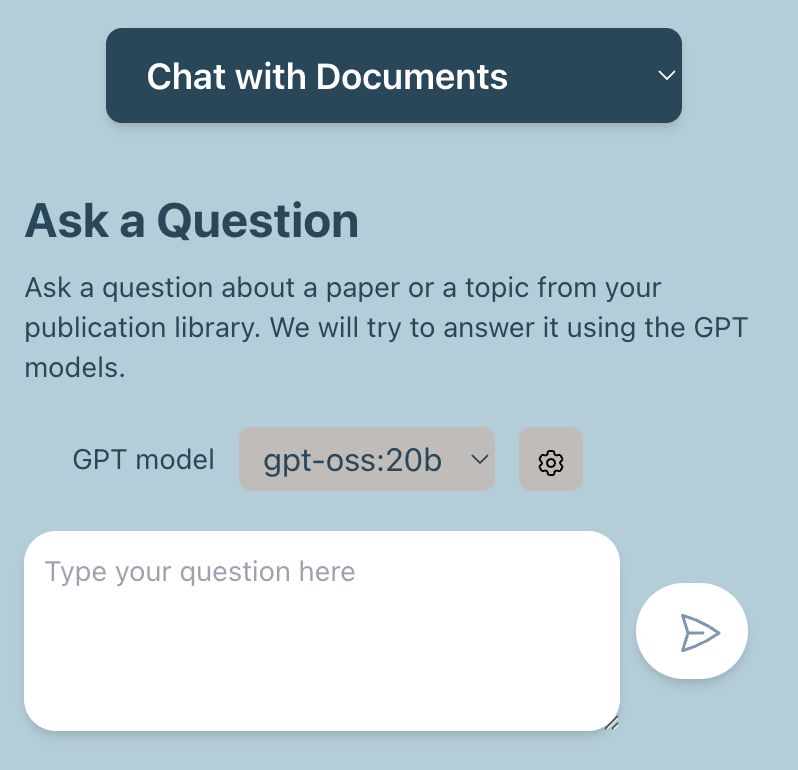
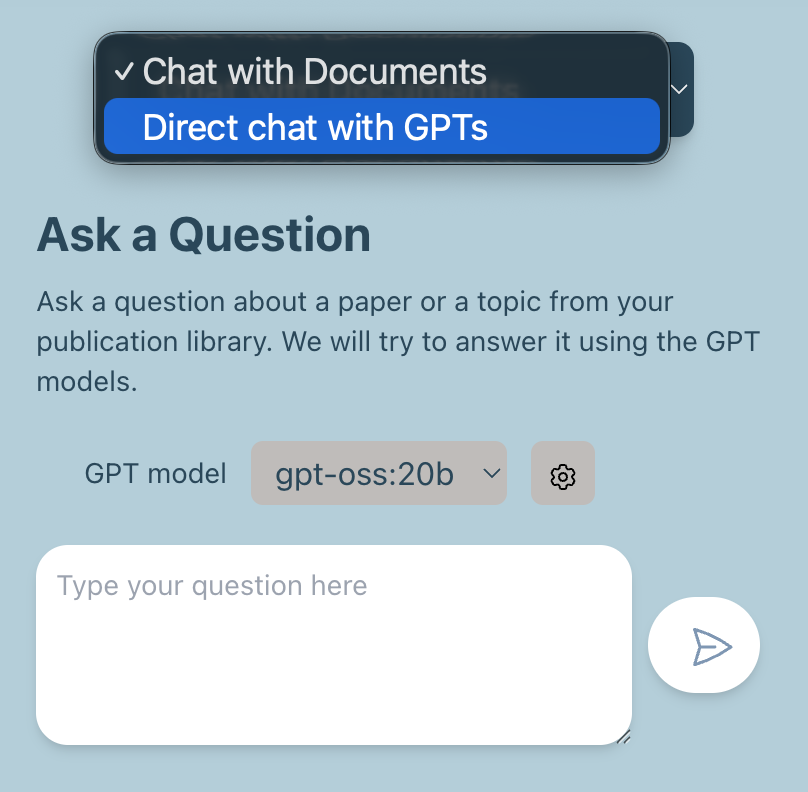
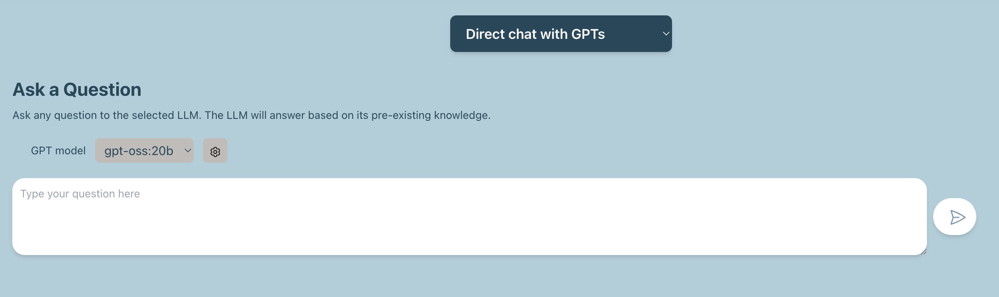
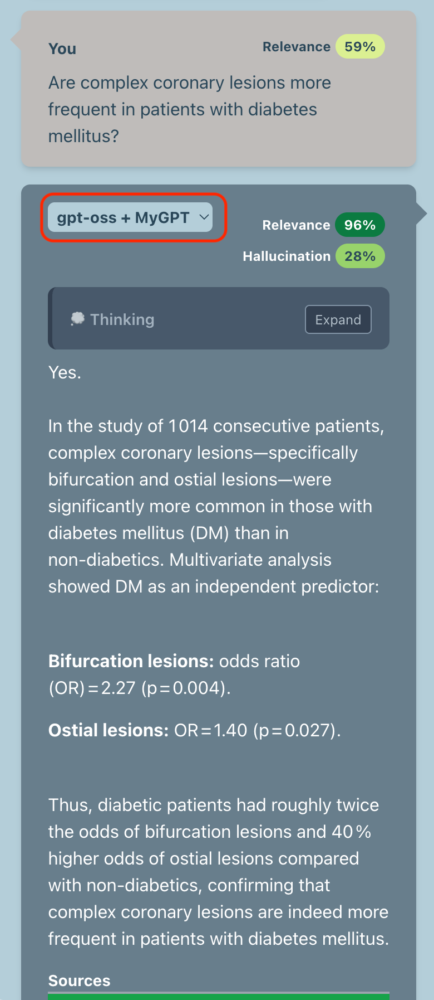
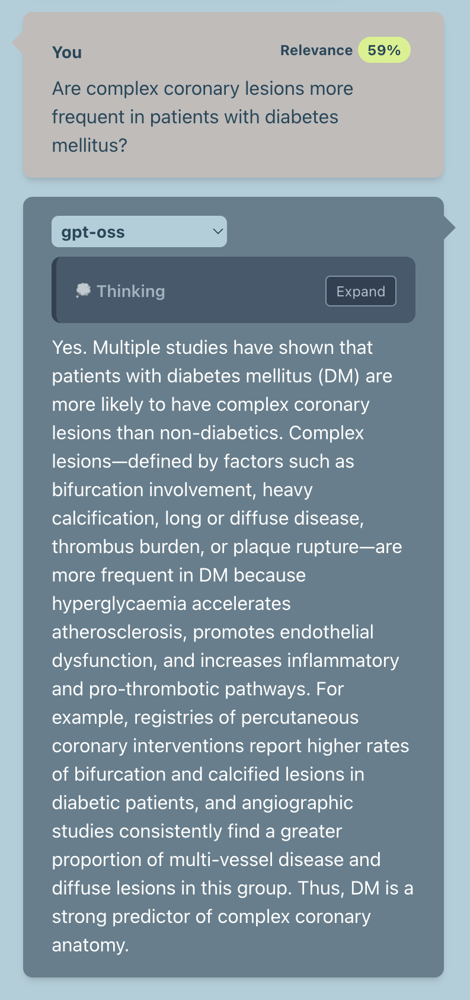
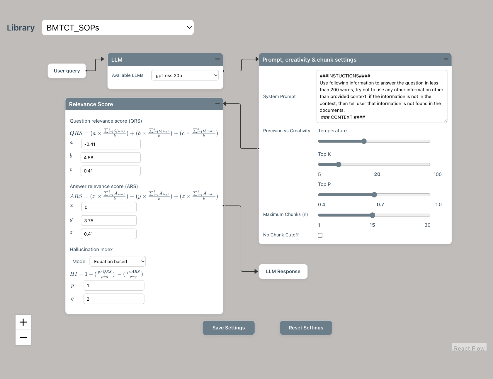

# FAQs

- [Asking questions](#asking-questions)
- [MyGPT answers](#mygpt-answers)
- [Confidence metrics](#confidence-metrics)
- [Library Creation](#library-creation)
- [Installation](#installation)
- [Customization](#customization)
- [General developers](#general-developers)

## Asking questions

### 1.	What kind of questions can I ask MyGPT?
During MyGPT evaluation, we have used six different question types as follows:
•	Keyword search: An acronym or a definition from the papers. For example, “What is acetyl-CoA?”
•	Summarization: Question that summarize a topic or method. For example, “What is the proof that pathogenic gain-of-function mutations can shift the equilibrium towards the active state in FGFRs?”
•	Yes/no: The answer can be a simple yes or no. For example, “Does the regulatory domain inhibit the PAK4 kinase activity?”
•	Data query: Question to find data or other facts from a section or information from several papers. For example, “Where are the leukemia-related breakpoints located in CBP/p300?”
•	Complex question: A research question to collect information from different parts of a paper and synthesize a response. For example, “What are the biggest issues facing the development of better CAR-T therapies? Rank them in order of difficulty and provide examples with citations on all potential strategies to overcome these limitations.”
•	Irrelevant question: A question about a topic that is not covered by the publication library. For example, asking questions about Harry Potter to a library of GPCR documents: “What does Hagrid give Harry as a Christmas present?”.   
You can also ask questions that do not follow the above categories, and MyGPT will answer them if they are within the limits of LLMs and RAG concepts. Several tasks, such as performing statistical analysis, analyzing whole documents, or listing references from literature with high accuracy, are beyond the current capability of LLMs and MyGPT.

### 2. Can I ask any questions about topics from my library?
You can ask questions that can be answered using the information available within your document library. If the data is missing from the documents, MyGPT will not be able to answer it or will let you know that the information is missing from your papers.
 
### 3. Can I ask a question about information that is in tables or figures in the library documents?
MyGPT will read tables as text and try to use that information to answer your question. However, it will not be able to parse the table and find the relationship between table columns and information from the table. Also, MyGPT will not perform statistical analysis for data present in the table. MyGPT can’t find information from the figures if it can only be answered by interpreting it or by performing the statistical analysis, although it will be able to read the legend of the figure. If the question can be answered using the legend, it can answer it.

## MyGPT answers

### 4.	What information does MyGPT uses to answer my question?
MyGPT uses information in the documents in your library as the primary source of information. If the information is missing from the library, MyGPT will use inherent knowledge of LLM, which was used for the training phase of specific LLM.

### 5. Is MyGPT using the internet to answer my question?
MyGPT does not use the internet or any external API services to get information to answer your question.

### 6. Can I use MyGPT to chat with LLM without incorporating the documents pipeline (RAG), like ChatGPT?
You can use MyGPT to chat directly with LLM without the RAG pipeline. At the top of the Chat panel, you can use the drop-down to switch from "Chat with Documents" to "Direct chat with GPTs". In this case, MyGPT will use LLM’s inherent knowledge to answer users' questions.

### 7. What happens if the information to answer the question is not available in my library?
If the information needed to answer the question is unavailable in your library, MyGPT will either acknowledge that it is missing from the library or, in rare cases, use the LLM’s inherent knowledge to answer it. It will also provide confidence matrices in the form of question relevance score (QRS), answer relevance score (ARS), and hallucination index (HI). Low QRS, QRS, and high HI should be interpreted as an indication to verify and cross-reference the generated answer with the retrieved context highlighted in the documents. Suppose the question is off-topic from the subjects covered in the papers. In that case, the QRS and ARS scores will be low, and HI will be high, indicating that the generated answer does not use any information from the document and is entirely generated using the LLM's inherent knowledge.  
   
### 8. If I am certain my library has the necessary information to answer the question, but MyGPT is not able to find it, what should I do?
We recommend several solutions if you are sure that the documents contain the information to answer the question. 
1.	The first thing to try is rephrasing it and providing more context with your question if it’s too short. 
2.	You can also adjust QRS and ARS cut-off values from the customizations. Certain words in embedding models have a higher distance than our perceived understanding of language as the specific domain knowledge was lacking in training of embedding models. Increasing the QCworst and Aworst values can aid in finding the correct context from documents.  
3.	We have also observed different embedding models provide different meanings to the same library of documents. So, if rephrasing and adjusting relevance scores doesn’t work, we recommend creating the same library with a different embedding model.
 
### 9. What happens if the information to answer the question is contained in a figure or table?
MyGPT will read tables as text and try to use that information to answer your question. However, it will not be able to parse the table and find the relationship between table column names and the data from the table. Also, MyGPT will not perform statistical analysis for data present in the table. MyGPT will be able to read the legend of the figure. If the question can be answered using the legend, it can answer it. However, if your question can only be answered by interpreting the figure or by comparing data present in your figure, MyGPT will not be able to answer it.

### 10. If there is information on my library that is outdated or inconsistent with facts available in public domain, will MyGPT detect the inconsistency?
MyGPT is designed to perform question-answering in the context of your library of documents and will hold the information from your documents as the highest truth. If the information in your document is outdated compared to facts in the public domain, MyGPT will answer them using only information from your documents. If the LLM has more up-to-date information about your question, the answer relevance score (ARS) and hallucination index (HI) may be able to guide you. MyGPT also provides answers generated without the RAG pipeline as the drop-down with the original MyGPT-generated answers. You can compare that answer with an original answer to verify the discrepancy in relevance scores. However, if the most up-to-date information about your topic is also missing from LLM training data, MyGPT will answer it only using information from your documents.  

### 11. If the answer is related to up-to-date information that is contained in my library but that was missing from the training data used for the LLM being used, will MyGPT be able to answer accurately?
Yes, MyGPT uses the facts present in your documents as the highest truth and will be able to use them as context to answer your question. MyGPT does not rely on LLM training data and eliminates the need for periodic retraining of LLMs with new information.

### 12.	Is MyGPT using any personal information about me as the knowledge base?
No, MyGPT does not use any personal information. It uses login information for hosted instances and it's independent of the RAG pipeline.

### 13.	Is there chat history available anywhere?
Yes, MyGPT has a “History” menu to access chat history, which is available for any public library or your libraries after logging in.

## Confidence metrics

### 14.	What are confidence metrics?
**Confidence metrics** are quantitative scores that MyGPT uses to gauge the trustworthiness of a generated answer.

* **QRS (Question Relevance Score)** – measures how well the user’s question matches the content in the document library. A high QRS indicates the question is on‑topic and likely supported by retrieved text.

* **ARS (Answer Relevance Score)** – evaluates how closely the answer aligns with the retrieved passages. A higher ARS indicates that the response is grounded in the source material.

* **HI (Hallucination Index)** – identifies potential hallucinations. A high HI signals that the answer may be largely generated from the LLM’s internal knowledge rather than the library, especially when QRS and ARS are low.

Together, these metrics help users determine whether an answer is supported by actual documents or might be a hallucinated response, enabling better verification and trust in the system.

### 15.	How are question relevance scores (QRS) and answer relevance scores (ARS) calculated, and how to interpret them?
**How QRS and ARS are computed**

| Score | Formula |
|-------|----------------------|
| **Question relevance scores (QRS)** | $$QRS=\left(a\times\frac{\sum_{i=1}^{k}Q_{sem,i}}{k}\right)+\left(b\times\frac{\sum_{i=1}^{k}Q_{key,i}}{k}\right)+\left(c\times\frac{\sum_{i=1}^{k}Q_{rerank,i}}{k}\right)$$ |
| **Answer relevance scores (ARS)** | $$ARS=\left(x\times\frac{\sum_{i=1}^{k}A_{sem,i}}{k}\right)+\left(y\times\frac{\sum_{i=1}^{k}A_{key,i}}{k}\right)+\left(z\times\frac{\sum_{i=1}^{k}A_{rerank,i}}{k}\right)$$ |

- $Q_{\text{sem}}, A_{\text{sem}}$: semantic similarity scores (vector-search).
- $Q_{\text{key}}, A_{\text{key}}$: keyword/BM25 scores.
- $Q_{\text{rerank}}, A_{\text{rerank}}$: cross-encoder rerank scores (0-1).

The sums are taken over the top‑k retrieved chunks that form the “golden context”.

**Interpretation**

| Score | Typical range | What it indicates |
|-------|---------------|-------------------|
| **High QRS** (close to 1) | Question is well‑matched to the library. | The library likely contains the needed information. |
| **Low QRS** (< 0.3) | Question poorly matches the library. | Information may be missing or irrelevant. |
| **High ARS** (close to 1) | Answer heavily relies on retrieved context. | Generated answer is grounded in the documents. |
| **Low ARS** (< 0.3) | Answer uses little or no retrieved content. | Possible hallucination; verify against source. |

The Hallucination Index (HI) combines QRS and ARS: low QRS/ARS → high HI, flagging potential hallucinations. Use these metrics to decide whether a generated answer should be trusted or cross‑checked with the documents.

### 16.	How is the hallucination index (HI) calculated, and how to interpret it?
Hallucination Index (HI) is a single‑score metric that blends the Question Relevance Score (QRS) and the Answer Relevance Score (ARS) to flag how much an LLM’s response may be “hallucinated” (i.e., not supported by the retrieved library).

$$HI = 1 - \left(\frac{p \times QRS}{p + q}\right) - \left(\frac{q \times ARS}{p + q}\right)$$

p and q are weighting factors that can be determined by global sensitivity analysis.

- **HI ≈ 0** – high QRS and ARS → the answer is strongly grounded in the library; hallucination unlikely.
- **HI close to 1** – low QRS or ARS → the answer likely relies on the LLM’s internal knowledge rather than the document set; higher risk of hallucination.

Thus, a lower HI signals a trustworthy, evidence‑based reply, while a higher HI warns that the response may contain unsupported or fabricated content.

### 17.	Can I change the calculations of QRS, ARS, and HI?

Yes, the default formulas are provided in the paper and the software, but they are not hard‑coded as the only possible choice. The weights (a,b,c) to calculate QRS and (x,y,z) to calculate ARS were chosen by a global‑sensitivity analysis that maximized PR‑AUC. If you prefer different weighting, you can re‑run the same heat‑map optimization with your own dataset or simply plug in new values from the chat settings menu.

### 18.	I am asking a question, and it’s about a topic in the library, but it gives me 0% relevance. Is it possible to relax the cutoff values for QRS?

Yes—MyGPT allows you to lower the QRS threshold so that documents with weaker matches can be retrieved.

Here’s how:
1. **Re‑phrase the question**: A longer or more specific query often yields higher semantic scores.

2. **Adjust the cutoff parameters**: In the MyGPT settings, you can change the weights (a, b, c). Setting c=0 removes reranking and provides all chunks from semantic and keyword searches. Or you can increase QCworst (the minimum cosine similarity allowed) and Aworst (the lowest keyword score accepted). Raising these values will relax the filter and bring more chunks into consideration.

3. **Try a different embedding model**: Some models encode domain terms better; switching to an alternative can improve relevance scores for your topic.

If, after these steps, the QRS remains 0 % and no relevant passages appear, it’s likely that the library simply does not contain the needed information. In that case, you may need to add additional documents or verify that the content is present in the existing files.

### (Following will be updated soon)

## Library creation

### 19.	What are the options for creating a library?
### 20.	What document types are supported by MyGPT?
### 21.	What is the library size limit supported by MyGPT?
### 22.	How much time it takes to upload a library? 
### 23.	How should I format my document library?
### 24.	Can MyGPT help me with library creation, management, or library expansion related to topics covered by the library?
### 25.	If a library is shared with other users, can they see my chat history?
### 26.	If I delete the library, will it delete chat history as well?

## Installation

### 27.	What are the options to install and use MyGPT?
### 28.	What is the minimum requirement for installing MyGPT on a laptop?
### 29.	How can I check if my computer/laptop is powerful enough to use MyGPT?
### 30.	Is there any advantage to using MyGPT when installing it on my computer?
### 31.	Is there any of using MyGPT by installing it on the server?
### 32.	How much will be hosting MyGPT on the cloud with minimum requirements cost?
### 33.	Is it possible to reduce hosting cost by sharing any infrastructure of MyGPT without compromising privacy?
### 34.	Where are the PDFs I have uploaded are located?
### 35.	Does MyGPT send any data to any external services or APIs?
### 36.	Does MyGPT work offline?

## Customization

### 37.	Which LLMs I can use with MyGPT?
### 38.	Can I use OpenAI or Gemini LLMs with MyGPT?
### 39.	Which are the embedding models I can use with MyGPT?
### 40.	What are the customizations offered by MyGPT?
### 41.	Can you suggest any ideal customizations for MyGPT?

## General developers

### 42.	Is there documentation on APIs available from MyGPT?
### 43.	How do I report a bug or feature for MyGPT?
### 44.	How can I contribute to the development of MyGPT?
