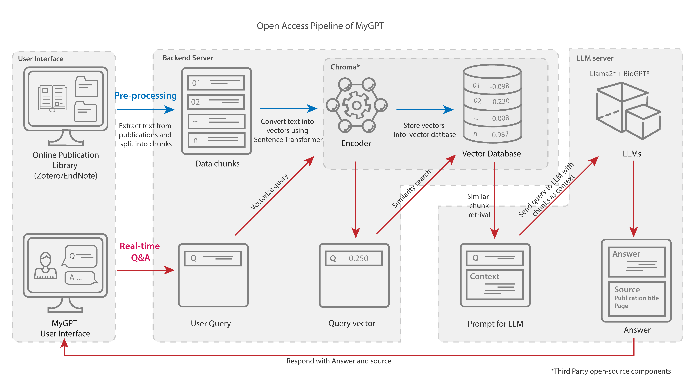

# MyGPT

ChatGPT has revolutionized creative occupations, but tasks requiring factual backing suffer from generalized models and limitations such as hallucinations and inconsistency. Here, we present MyGPT — an open-source Large Language Model (LLM) pipeline to ask questions for content from a curated list of publications or video/audio lectures. MyGPT minimizes hallucination by providing a context for the question and generates accurate answers with source citing. MyGPT can run on personal devices or cloud infrastructures and can help with complex tasks such as literature review and learning. 

## Pipeline

We have divided the MyGPT pipeline architecture into three sections: 
1. <b>User interface (UI)</b>: The UI is the front-end of the pipeline. It is a web application that allows users to interact with the pipeline. The UI is built using ReactJS.
2. <b>Backend server</b>: The backend server is responsible for handling requests from the UI and sending them to the LLM server. The backend server is built using Python Django.
3. <b>LLM server</b>: The LLM server is responsible for generating answers to the questions asked by the user. The LLM server is built using Django and Llama-CPP-Python.

## Installation

MyGPT can be installed on following environments:

- [Personal Computer (MacBook) - no GPU](#personal-computer-(MacBook)---no-gpu)
- [Personal Computer (MacBook)- Apple GPU](#personal-computer---gpu)
- [Google Colab - no GPU](https://)
- [Google Colab - GPU (T40)](https://)
- [Google Colab - GPU (A100)](https://)
- [Server with GPU](#server)
- [Amazon Web Services](#amazon-web-services)

### Personal Computer (MacBook) - no GPU

For this installtion, the entire pipeline will run as a single unit on CPU. This is the easiest way to get started with MyGPT, but it is also the slowest.