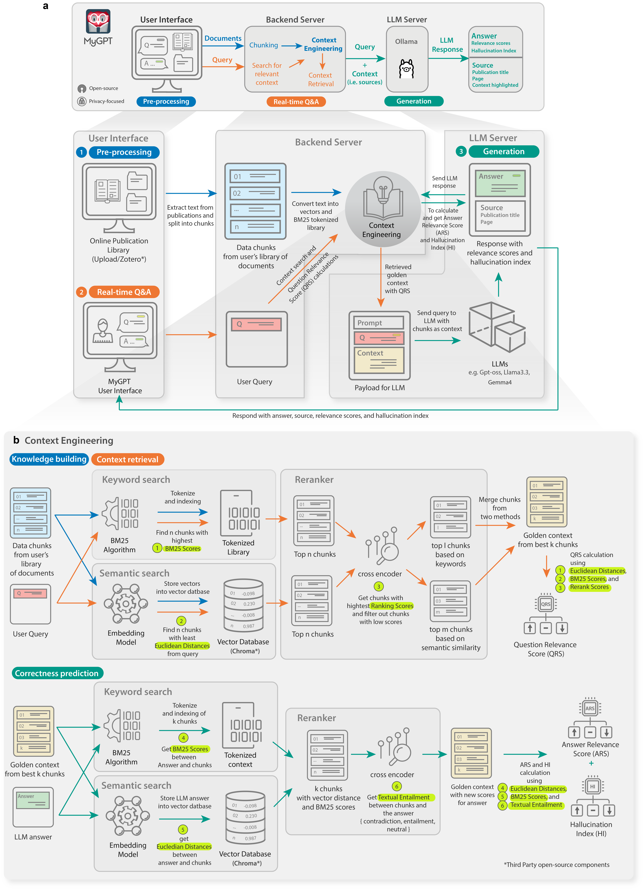
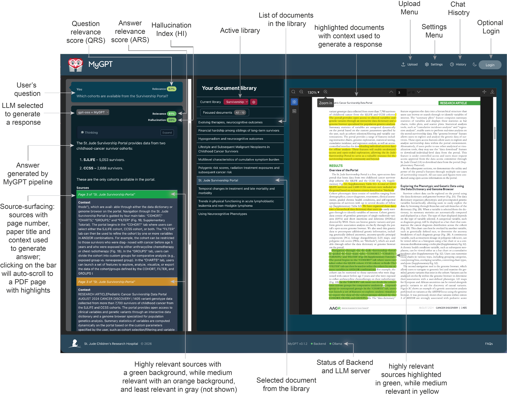

[](https://github.com/stjude/MyGPT/actions/workflows/backend-ci.yml) [](https://github.com/stjude/MyGPT/actions/workflows/frontend-ci.yml) [](https://github.com/stjude/MyGPT/actions/workflows/backend-docker-image.yml) [](https://github.com/stjude/MyGPT/actions/workflows/frontend-docker-image.yml) [](https://doi.org/10.5281/zenodo.22165249)

<!-- make div and show logo in middle -->
<div align="center" style='padding:20px;'>
	
</div>

# MyGPT

ChatGPT has revolutionized creative occupations, but tasks requiring factual backing suffer from generalized models and limitations such as hallucinations and inconsistency. Here, we present MyGPT — an open-source Large Language Model (LLM) pipeline to ask questions for content from a curated list of publications or video/audio lectures. MyGPT minimizes hallucination by providing a context for the question and generates accurate answers with source citing. MyGPT can run on personal devices or cloud infrastructures and can help with complex tasks such as literature review and learning. 

## Pipeline



We have divided the MyGPT pipeline architecture into three sections: 
1. <ins>User interface (UI)</ins>: The UI is the front-end of the pipeline. It is a web application that allows users to interact with the pipeline. The UI is built using ReactJS.
2. <ins>Backend server</ins>: The backend server is responsible for handling requests from the UI and sending them to the LLM server. The backend server is built using Python Django.
3. <ins>LLM server</ins>: The LLM server is responsible for generating answers to the questions asked by the user. We are using Ollama for the LLM server.

## Installation

Before running any Docker Compose workflow, create the ignored runtime environment files from the tracked templates at the repository root:

```bash
cp .env_backend.example .env_backend
cp .env_frontend.example .env_frontend
```

Replace the placeholders in `.env_backend` with secure values and configure public browser settings in `.env_frontend`. These runtime files are injected by Docker Compose, are ignored by Git, and are excluded from Docker build contexts. Never put secrets in `.env_frontend`; variables prefixed with `VITE_` are visible to browser users.

MyGPT can be installed on following environments:

- [Desktop Application (macOS / Windows / Linux)](#desktop-application)
- [Personal Computer](#personal-computer)
- [Server/VM with GPU](#server-or-vm-with-gpu)
- [Cloud services (Azure)](#cloud-services-azure)

### Desktop Application

MyGPT provides a native desktop application with modern window management, local Docker orchestration, and in-app developer settings:

* **macOS Local Install:** Download the `.dmg` from releases. See [macOS Installation & Setup Guide](./electron/MACOS_INSTALL_GUIDE.md) for quick setup, Ollama models, and Gatekeeper instructions.
* **Remote VM & Cloud Connected Desktop Apps:** See [Remote VM & Cloud Desktop Guide](./electron/REMOTE_CLOUD_DESKTOP_GUIDE.md) to build and distribute lightweight desktop apps connected to remote GPU servers or Azure/AWS/GCP deployments.
* **Packaging & Development:** See [electron/README.md](./electron/README.md) for build, test, and packaging scripts.

### Personal Computer

MyGPT is using Ollama for LLM server, and it requires at least 8GB (16GB for better response time) of RAM and 10GB of disk space.
Also, Ollama is providing direct installation on Mac and Linux only. For Windows users we will use Docker to run Ollama.

To run the pipleine on following environments, follow the instructions:
* Mac
	- [Basic Installation](./installation/macOS/README.md)
	<!-- - Detailed instructions: [](https://colab.research.google.com/drive/1h92XHMT5D_vlmf2oEZ0BRn3ke41Cz9p4?usp=sharing)
	This are instructions with interactive Jupyter notebook on Google colab, it has troubleshooting steps. If you come across any bug or error, please report it in the issues section. You can also modify Jupyter notebook as per your convenience. -->
* Linux
	- [Basic Installation](./installation/linux/README.md)
	<!-- - Detailed instructions: [](https://colab.research.google.com/drive/1feKcAvNwMIZpx7UGOb3UYhw_HFMC_kHP?usp=sharing)
	This are instructions with interactive Jupyter notebook on Google colab, it has troubleshooting steps. If you come across any bug or error, please report it in the issues section. You can also modify Jupyter notebook as per your convenience. -->
* Windows 
	- [Basic Installation](./installation/windows/README.md)
	<!-- - [](https://colab.research.google.com/drive/1r9cGHFwl4VStyb0szC4U-6hidXjtZBDE?usp=sharing) -->

	These instructions are simple and easy to follow. You can also modify bash scripts as per your convenience.

### Server or VM with GPU

MyGPT can be hosted on a server or VM with GPU. For this installation we recommand to host User interface (UI), Backend server and Ollama (LLM server) on 3 seperate VMs. The Ollama VM should have a GPU with CUDA installed on the server/VM.

To run the pipleine on VM/Server, follow the instructions:
* [Linux Server Installation](./installation/vm/README.md)

### Cloud services (Azure)

MyGPT can be hosted on any cloud service but we are providing Azure as an example deploymnet. For this installation we recommand to host User interface (UI), Backend server and Ollama (LLM server) on 3 seperate VMs. The Ollama VM should have a GPU with CUDA installed on the VM.

To run the pipleine on Azure, follow the instructions:
* [Azure Installation](./installation/azure/README.md)

## Dependencies

For a complete list of backend and frontend dependencies, see [dependencies.md](./dependencies.md).

For environment-specific dependencies and prerequisites, refer to the installation guides:

- Mac: [installation/macOS/README.md](./installation/macOS/README.md)
- Linux: [installation/linux/README.md](./installation/linux/README.md)
- Windows: [installation/windows/README.md](./installation/windows/README.md)
- VM/Server: [installation/vm/README.md](./installation/vm/README.md)
- Cloud (Azure): [installation/azure/README.md](./installation/azure/README.md)

## User Interface
MyGPT user interface will allow users to check the publcation library, ask questions, and get answers. The user interface is built using ReactJS.

Here is an example of the user interface with question, answer, and source citing:



## FAQs

Check out the [FAQs](./FAQs.md) for common questions and answers.

## Citation

The research paper describing MyGPT is currently **in press**. Please use the following citation until the final publication details are available:

> Patel J, Downing J, Ferguson H, You T, Malinverni D, Mathew D A S, Chen I, Sluter M, Moorefield B, Parej K, Ragavan M, Morris C, Keerthi D, Becerra Armada D, Meszaros B, Trivedi V, Alam S, Woodard A, Alford D, Pathak S, Li C, Umeton R, Rodriguez-Galindo C, Lam CG, Gottschalk S, Kalodimos CG, Babu MM. Democratizing reliable knowledge-seeking with MyGPT: A Privacy-First, Open-Source Retrieval-Augmented Generation Platform. In press.

In text, cite the paper as **Patel et al. (in press)** or **(Patel et al., in press)**. The journal, volume, page numbers, publication year, and DOI will be added here once the paper is published.

BibTeX:

```bibtex
@article{patel2026mygpt,
	author  = {Patel, Jaimin and Downing, Jude and Ferguson, Hugh and You, Thika and Malinverni, Duccio and Mathew D. A., Steve and Chen, Ines and Sluter, Madison and Moorefield, Beth and Parej, Katalin and Ragavan, Mukundan and Morris, Cindy and Keerthi, Dinesh and Becerra Armada, Desiree and Meszaros, Balint and Trivedi, Vikas and Alam, Shahinur and Woodard, Anthony and Alford, Dan and Pathak, Sagar and Li, Cai and Umeton, Renato and Rodriguez-Galindo, Carlos and Lam, Catherine G. and Gottschalk, Stephen and Kalodimos, Charalampos G. and Babu, M. Madan},
	title   = {Democratizing reliable knowledge-seeking with MyGPT: A Privacy-First, Open-Source Retrieval-Augmented Generation Platform},
	note    = {In press},
}
```

## Evaluation datasets and Benchmarks
For all datasets presented in the paper, the scripts used to reproduce the results are available in the GitHub repository at: [MyGPT-evaluations](https://github.com/stjude/MyGPT-evaluations). The BioASQ evaluation corpus used in this study was curated as a collection of PDF documents and has been deposited in GitHub at https://github.com/stjude/MyGPT-evaluations/tree/main/BioASQ/inputs/pdfs. The PubMedQA and Open RAG Benchmark datasets, as well as the kinase literature use case dataset, are based on published articles obtained through institutional subscriptions and licensing agreements. Although the corresponding PDF files cannot be redistributed, the PubMed IDs (PMIDs) and Digital Object Identifiers (DOIs) required to retrieve the source publications are provided in the GitHub repository referenced above. The BMTCT Standard Operating Procedure (SOP) documents are not publicly available as they contain confidential institutional information that is subject to institutional legal and administrative requirements. The authors do not have permission to redistribute these materials. PDF health policy documents analyzed in the multilingual study are publicly available and have been deposited in GitHub at: https://github.com/stjude/MyGPT-evaluations/tree/main/health_policies/inputs.  Reviewer-validated assessments of generated multilingual policy analyses are not publicly available but may be obtained from the corresponding author for academic research purposes, subject to any applicable data-sharing restrictions. Evaluation results for all other experiments presented in the manuscript are provided in  *Supplementary Data 1* in the paper. 

## Developer's Guide

Developers who are interested in using MyGPT API can check the [developer's guide](./development.md).

## Issues

If you come across any bug or error, please report it in the [issues](https://github.com/stjude/MyGPT/issues) section.
